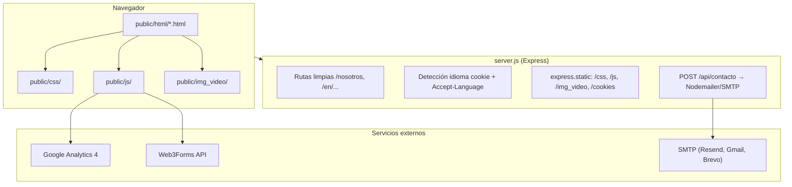

# Documentación técnica — GeoPlataforma

Sitio web corporativo de **Geotrends / GeoPlataforma**: ingeniería acústica, analítica geoespacial, IoT, mapas de ruido y soluciones para ciudades e industria.

**Dominio de producción:** `https://es.geotrends.co`

---

## Tabla de contenidos

1. [Resumen del proyecto](#1-resumen-del-proyecto)
2. [Stack tecnológico](#2-stack-tecnológico)
3. [Arquitectura general](#3-arquitectura-general)
4. [Estructura de carpetas](#4-estructura-de-carpetas)
5. [Backend: `server.js`](#5-backend-serverjs)
6. [Vistas (HTML)](#6-vistas-html)
7. [Estilos (CSS)](#7-estilos-css)
8. [Lógica del cliente (JavaScript)](#8-lógica-del-cliente-javascript)
9. [Medios e imágenes](#9-medios-e-imágenes)
10. [Sistema bilingüe (ES / EN)](#10-sistema-bilingüe-es--en)
11. [Páginas y sus recursos](#11-páginas-y-sus-recursos)
12. [Proyectos: datos y galerías](#12-proyectos-datos-y-galerías)
13. [Formulario de contacto](#13-formulario-de-contacto)
14. [SEO, analytics y cookies](#14-seo-analytics-y-cookies)
15. [Scripts de mantenimiento](#15-scripts-de-mantenimiento)
16. [Despliegue](#16-despliegue)
17. [Desarrollo local](#17-desarrollo-local)
18. [Convenciones para extender el sitio](#18-convenciones-para-extender-el-sitio)

---

## 1. Resumen del proyecto

GeoPlataforma es un **sitio web multi-página (MPA)** construido con HTML, CSS y JavaScript vanilla. No usa frameworks de frontend (React, Vue, etc.) ni bundlers (Webpack, Vite).

El patrón arquitectónico es:

| Capa | Ubicación | Rol |
|------|-----------|-----|
| **Vistas** | `public/html/` | Estructura y contenido de cada página |
| **Estilos** | `public/css/` | Presentación, tema oscuro, responsive |
| **Lógica** | `public/js/` | Interactividad por página y módulos compartidos |
| **Medios** | `public/img_video/` | Imágenes, vídeos, iconos |
| **Servidor** | `server.js` | Rutas limpias, i18n, API de contacto, archivos estáticos |

En producción puede desplegarse de dos formas:

- **Con Node.js/Express** (`server.js`): rutas `/nosotros`, detección de idioma, endpoint `/api/contacto`.
- **Como sitio estático** (S3 + CloudFront): solo la carpeta `public/`, con reglas de reescritura en CloudFront.

---

## 2. Stack tecnológico

### Backend / runtime

| Tecnología | Versión | Uso |
|------------|---------|-----|
| **Node.js** | — | Servidor local y despliegues con Express |
| **Express** | ^4.18 | Servidor HTTP, rutas, estáticos, API |
| **dotenv** | ^17.4 | Variables de entorno (`.env`) |
| **Nodemailer** | ^8.0 | Envío SMTP del formulario (alternativa a Web3Forms) |

### Frontend

| Tecnología | Uso |
|------------|-----|
| **HTML5** | Páginas semánticas, SEO, JSON-LD |
| **CSS3** | Variables CSS, `@import`, glassmorphism, animaciones |
| **JavaScript (ES5/ES6 IIFE)** | Sin transpilación; módulos en archivos separados |
| **Google Analytics 4** | `G-2N3W909JPC` (carga condicional tras consentimiento de cookies) |
| **Web3Forms** | Envío del formulario de contacto desde el navegador |

### Herramientas auxiliares

| Herramienta | Archivo | Uso |
|-------------|---------|-----|
| **Python + Pillow** | `convert_to_webp.py` | Conversión masiva de imágenes a WebP |
| **Python** | `remove_original_images.py` | Limpieza de originales tras conversión |
| **Node scripts** | `scripts/` | Generación de páginas EN, parches SEO |

### Infraestructura

| Plataforma | Configuración |
|------------|---------------|
| **AWS S3 + CloudFront** | `.github/workflows/deploy-aws-static.yml`, `docs/AWS_DEPLOY.md` |
| **Vercel** | `vercel.json` (rewrites básicos; limitado frente a Express) |
| **Render / Railway / etc.** | `npm start` → `node server.js` |

---

## 3. Arquitectura general



### Flujo de una petición (modo Express)

1. El usuario visita `/ciudades` o `/en/contacto`.
2. `redirectUrlToMatchLangCookie` alinea la URL con la cookie `site_lang` (si existe).
3. `detectPreferredLang` puede redirigir a `/en/...` según `Accept-Language`.
4. `sendHtmlPage` resuelve el archivo en `public/html/` o `public/html/en/`.
5. El HTML carga CSS/JS con rutas absolutas (`/js/...`) o relativas (`../css/...`).
6. Los scripts compartidos inicializan navbar, tema, transiciones, cookies, etc.

### Patrón de composición de una página

Todas las páginas siguen la misma plantilla mental:

```
<head>
  meta SEO + JSON-LD
  data-theme="dark" (inline)
  index.css          ← base global (navbar, footer, tema)
  [página].css       ← estilos específicos
  transitions.css    ← animaciones entre páginas
  cookie-banner.css
</head>
<body class="page-[nombre]">
  <nav> ... navbar compartido ... </nav>
  <main> ... contenido de la página ... </main>
  <footer> ... footer compartido ... </footer>
  <script> módulos compartidos + específicos de página </script>
</body>
```

---

## 4. Estructura de carpetas

```
geoPlataforma/
├── public/                      # Todo el sitio estático (se despliega a S3)
│   ├── html/                    # VISTAS — páginas HTML
│   │   ├── index.html           # Home (ES)
│   │   ├── nosotros.html
│   │   ├── contacto.html
│   │   ├── ciudades.html
│   │   ├── industria.html
│   │   ├── blog.html
│   │   ├── blog-detalle.html
│   │   ├── proyectos-ciudades.html
│   │   ├── proyectos-industria.html
│   │   ├── proyecto-detalle.html
│   │   ├── trabaja-con-nosotros.html
│   │   ├── representaciones-distribucion.html
│   │   ├── politicas-privacidad.html
│   │   ├── google5a5ea90ecf516a08.html   # Verificación Google Search Console
│   │   ├── en/                  # Espejo inglés de las páginas anteriores
│   │   └── proyectos/data/      # Datos JS de galerías por proyecto
│   ├── css/                     # ESTILOS
│   │   ├── index.css            # Entry point home (importa todo home/)
│   │   ├── theme.css            # Variables y modo oscuro
│   │   ├── responsive.css       # Media queries globales
│   │   ├── transitions.css      # Fade entre páginas
│   │   ├── scroll-top.css
│   │   ├── navbar/navbar.css
│   │   ├── home/                # Secciones del index (hero, wind, faq…)
│   │   ├── pages/               # Páginas internas (about, contacto, blog…)
│   │   ├── servicios/           # ciudades.css, (industria usa ciudades.css)
│   │   └── proyectos/           # Listados y detalle de proyectos
│   ├── js/                      # LÓGICA
│   │   ├── nav.js               # Navbar, dropdowns, hamburguesa
│   │   ├── theme.js             # Tema oscuro + favicon
│   │   ├── lang-nav.js          # Selector de idioma + cookie site_lang
│   │   ├── transitions.js       # Transiciones entre páginas
│   │   ├── lazy-videos.js       # Carga diferida de vídeos
│   │   ├── smooth-wheel.js      # Scroll suave en desktop
│   │   ├── scroll-top.js        # Botón volver arriba
│   │   ├── inicio/              # Lógica exclusiva del home
│   │   ├── contacto/
│   │   ├── nosotros/
│   │   ├── servicios/
│   │   ├── proyectos/
│   │   ├── blog/
│   │   └── trabaja/
│   ├── img_video/               # MEDIOS (webp, mp4, svg)
│   ├── cookies/                 # Banner de consentimiento (HTML/CSS/JS)
│   ├── sitemap.xml
│   ├── robots.txt
│   └── favicon.ico
├── server.js                    # Servidor Express
├── package.json
├── vercel.json
├── .env.example                 # Plantilla SMTP / contacto
├── convert_to_webp.py           # Utilidad de optimización de imágenes
├── remove_original_images.py
├── scripts/                     # Scripts Node de build/mantenimiento
│   ├── generate-en-pages.js     # Genera páginas EN desde ES
│   ├── apply-seo-jsonld-hreflang.js
│   └── patch-trabaja-con-nosotros.js
├── docs/
│   ├── DOCUMENTACION.md         # Este archivo
│   └── AWS_DEPLOY.md
├── .github/workflows/
│   └── deploy-aws-static.yml    # CI/CD → S3 + CloudFront
└── img/                         # Assets de diseño / borradores (no servidos en prod)
```

---

## 5. Backend: `server.js`

Express actúa como **servidor de archivos estáticos selectivo** + **enrutador de páginas HTML** + **API mínima**.

### Archivos estáticos expuestos

| Ruta URL | Carpeta en disco |
|----------|------------------|
| `/css/*` | `public/css/` |
| `/js/*` | `public/js/` |
| `/img_video/*` | `public/img_video/` (MP4 sin caché agresiva) |
| `/cookies/*` | `public/cookies/` |
| `/proyectos/data/*` | `public/html/proyectos/data/` |
| `/favicon.ico` | `public/img_video/home/favicon-hero.png` |
| `/sitemap.xml`, `/robots.txt` | `public/` |

> Express **no** sirve `public/html/` como estático directo. Las páginas HTML se entregan mediante rutas dedicadas para soportar URLs limpias.

### Rutas HTML

| URL | Archivo servido |
|-----|-----------------|
| `/` | `public/html/index.html` (o redirección a `/en`) |
| `/nosotros` | `public/html/nosotros.html` |
| `/en/nosotros` | `public/html/en/nosotros.html` |
| `/:page` | `public/html/:page.html` |
| `/:page.html` | `public/html/:page.html` |

### Internacionalización en servidor

| Mecanismo | Descripción |
|-----------|-------------|
| Cookie `site_lang` | Valores `es` o `en`. Se escribe en `/prefer-es` y `/prefer-en`, o desde `lang-nav.js` al elegir idioma |
| `Accept-Language` | Si no hay cookie, se parsea el header HTTP (con calidad `q`) |
| Redirección automática | Usuarios con preferencia EN van a `/en/...` (excepto crawlers) |
| Alineación cookie ↔ URL | Si la cookie dice `es` y visitas `/en/foo`, redirige a `/foo` |

### API: `POST /api/contacto`

Endpoint alternativo al formulario Web3Forms. Recibe JSON:

```json
{
  "nombre": "string",
  "email": "string",
  "telefono": "string (opcional)",
  "mensaje": "string (opcional)",
  "company": "honeypot — si tiene valor, se ignora",
  "lang": "es | en"
}
```

- **Rate limit:** 5 peticiones / 10 min por IP (en memoria).
- **SMTP:** variables `SMTP_HOST`, `SMTP_USER`, `SMTP_PASS`, etc. en `.env`.
- **Destino:** `CONTACT_TO` (default `info@geotrends.co`).

> En producción actual, el formulario del navegador usa **Web3Forms** (`contacto.js`), no este endpoint. El endpoint Express queda disponible para migraciones o entornos sin terceros.

---

## 6. Vistas (HTML)

### Páginas en español (`public/html/`)

| Archivo | Ruta limpia | Descripción |
|---------|-------------|-------------|
| `index.html` | `/` | Página principal con hero, servicios, tecnologías, FAQ |
| `nosotros.html` | `/nosotros` | Equipo, propósito, valores, reconocimientos |
| `contacto.html` | `/contacto` | Formulario, mapa, datos de contacto |
| `ciudades.html` | `/ciudades` | Servicios sector ciudades (paneles por hash) |
| `industria.html` | `/industria` | Servicios sector industria |
| `proyectos-ciudades.html` | `/proyectos-ciudades` | Portafolio proyectos ciudades |
| `proyectos-industria.html` | `/proyectos-industria` | Portafolio proyectos industria |
| `proyecto-detalle.html` | `/proyecto-detalle` | Detalle dinámico vía query params |
| `blog.html` | `/blog` | Listado de artículos |
| `blog-detalle.html` | `/blog-detalle` | Artículo individual |
| `trabaja-con-nosotros.html` | `/trabaja-con-nosotros` | Vacantes y carrusel |
| `representaciones-distribucion.html` | `/representaciones-distribucion` | Partners y distribución |
| `politicas-privacidad.html` | `/politicas-privacidad` | Política de privacidad y cookies |

### Páginas en inglés (`public/html/en/`)

Mismo conjunto de páginas con `lang="en"` y textos traducidos. Se generan/actualizan con `scripts/generate-en-pages.js`.

### Elementos comunes en todas las vistas

- **Navbar** con dropdowns de Servicios y Proyectos (paneles laterales con enlaces ancla).
- **Selector de idioma** (banderas ES / EN).
- **Footer** con navegación, redes sociales (LinkedIn, Instagram, WhatsApp), dirección y horario.
- **Meta tags SEO:** `title`, `description`, `canonical`, `hreflang`, Open Graph, JSON-LD (`Organization` + `WebSite`).
- **Clase en `<body>`** para estilos específicos: `page-home`, `page-contacto`, `page-about`, `page-servicios`, etc.

### Home: secciones principales (`index.html`)

| Sección CSS | Contenido |
|-------------|-----------|
| `.hero` | Vídeo de fondo, logo, título principal |
| `.geotrends-section` | Presentación startup + vídeo IoT |
| `.wind-section` | Carrusel de servicios (Ciudades / Industria) |
| `.tech-section` | Iconos de tecnologías |
| `.process-section` | Proceso de trabajo |
| `.dashboard-section` | Dashboard / plataforma |
| `.recon-section` | Reconocimientos |
| `.faq-section` | Preguntas frecuentes |
| `.join-team-section` | CTA trabaja con nosotros |

---

## 7. Estilos (CSS)

### Entry point global: `index.css`

Aunque se llama `index.css`, se importa en **casi todas las páginas** como base compartida:

```css
@import url('home/base.css');      /* Reset, tipografía, utilidades */
@import url('navbar/navbar.css');  /* Barra de navegación */
@import url('theme.css');          /* Paleta y modo oscuro */
@import url('home/hero.css');      /* Estilos hero (también reutilizados) */
/* ... más secciones home ... */
@import url('home/footer.css');
@import url('scroll-top.css');
@import url('responsive.css');
```

### `theme.css`

- Define variables CSS (`--geo-military-green`, `--geo-beige`, etc.).
- Modo oscuro con `[data-theme="dark"]` en `<html>`.
- Estilos glassmorphism para navbar, cards y componentes en dark mode.
- El tema se fuerza a oscuro vía script inline en `<head>` y `theme.js`.

### Organización por dominio

| Carpeta / archivo | Responsabilidad |
|-------------------|-----------------|
| `css/home/` | Una hoja por sección del index (hero, wind, tech, faq…) |
| `css/pages/` | `about.css`, `contacto.css`, `blog.css`, `trabaja-nosotros.css` |
| `css/servicios/ciudades.css` | Layout de paneles laterales en ciudades e industria |
| `css/proyectos/` | Grid de proyectos y página de detalle |
| `css/navbar/navbar.css` | Dropdowns, hamburguesa, paneles de servicios |
| `css/transitions.css` | Clases `.page-transitioning`, `.reveal-item`, entrada/salida |
| `css/responsive.css` | Breakpoints globales (navbar colapsa ~1100px) |

### Patrón de carga por página

```
index.css          → siempre (base + navbar + footer + tema)
[pagina].css       → solo en esa página
transitions.css    → siempre
cookie-banner.css  → siempre
```

---

## 8. Lógica del cliente (JavaScript)

Todos los scripts usan **IIFE** (`(function() { ... })();`) sin módulos ES6. Se cargan con `<script src="...">` en orden de dependencia.

### Módulos compartidos (casi todas las páginas)

| Archivo | Función |
|---------|---------|
| `transitions.js` | Fade al navegar entre páginas; scroll al top al cargar |
| `lazy-videos.js` | Carga diferida de `<video>`; expone `window.geoLazyVideosRefresh()` |
| `lang-nav.js` | Calcula URLs ES/EN; escribe cookie `site_lang` al cambiar idioma |
| `nav.js` | Dropdowns Servicios/Proyectos, menú hamburguesa móvil, overlay |
| `theme.js` | Aplica `data-theme="dark"`, logo y favicon |
| `smooth-wheel.js` | Scroll suave con rueda en desktop (respeta `prefers-reduced-motion`) |
| `scroll-top.js` | Crea y controla botón flotante “volver arriba” |
| `cookies/cookie-banner.js` | Banner GDPR; carga GA4 solo tras aceptar |

### Módulos por página

| Archivo | Página(s) | Función |
|---------|-----------|---------|
| `inicio/inicio.js` | `index.html` | Hero vídeo fallback, navbar por sección, carruseles wind/tech/faq |
| `nosotros/nosotros.js` | `nosotros.html` | Paneles Quiénes somos / Propósito / Valores; equipo; reconocimientos |
| `contacto/contacto.js` | `contacto.html` | Envío formulario vía Web3Forms |
| `servicios/ciudades.js` | `ciudades.html`, `industria.html` | Barra de pills, paneles por `#hash`, animaciones |
| `servicios/industria.js` | `industria.html` | Lógica adicional específica industria |
| `proyectos/proyectos-ciudades.js` | `proyectos-ciudades.html` | Filtros por servicio, carrusel |
| `proyectos/proyectos-industria.js` | `proyectos-industria.html` | Filtros, visibilidad por tag, carrusel |
| `proyectos/proyecto-detalle.js` | `proyecto-detalle.html` | Lee query params, renderiza galería y metadatos |
| `blog/blog.js` | `blog.html` | Búsqueda (placeholder) |
| `trabaja/trabaja-carousel.js` | `trabaja-con-nosotros.html` | Carrusel de vacantes, modal móvil |

### Orden típico de scripts (ejemplo contacto)

```html
<script src="../js/transitions.js"></script>
<script src="../js/lazy-videos.js"></script>
<script src="../js/contacto/contacto.js"></script>  <!-- específico -->
<script src="/js/lang-nav.js"></script>
<script src="../js/nav.js"></script>
<script src="../js/theme.js"></script>
<script src="../js/smooth-wheel.js"></script>
<script src="../js/scroll-top.js"></script>
<script src="/cookies/cookie-banner.js"></script>
```

> Nota: algunos scripts usan ruta absoluta (`/js/lang-nav.js`) y otros relativa (`../js/nav.js`). Ambas funcionan con Express; en S3/CloudFront las rutas absolutas apuntan a la raíz del bucket.

### “Librerías” del proyecto

No hay `node_modules` en el frontend. Las “librerías” son **módulos propios reutilizables**:

| Módulo | API pública | Consumidores |
|--------|-------------|--------------|
| `lazy-videos.js` | `window.geoLazyVideosRefresh()` | Proyectos al filtrar cards |
| `lang-nav.js` | Cookie `site_lang`, enlaces `.nav-lang-option` | Todas las páginas |
| `cookie-banner.js` | Cookie `geo_cookie_consent` | Todas las páginas |
| `transitions.js` | Clases CSS en `body` | Navegación interna |

Para añadir un módulo compartido: crear el `.js` en `public/js/`, incluirlo en las páginas que lo necesiten, y opcionalmente exponer funciones en `window` si otros scripts deben llamarlo.

---

## 9. Medios e imágenes

### Carpeta `public/img_video/`

| Subcarpeta | Contenido |
|------------|-----------|
| `home/` | Hero, logos, favicon, vídeos IoT/portafolio, cards ciudades/industria |
| `ciudades/` | Imágenes y vídeos por servicio (iot, mapasRuido, webgis…) |
| `industria/` | Imágenes por servicio industrial |
| `servicios/` | Thumbnails para cards de servicios |
| `proyectos/` | Portadas y medios de proyectos |
| `sobreNosotros/` | Fotos equipo, vídeos fondo/propósito, iconos valores |
| `blog/` | Imágenes de artículos |
| `nav/` | Banderas SVG (ES, US) |
| `tecnologias/iconos/` | Iconos WebP de tecnologías |
| `reconocimientos/` | Logos de premios |
| `trabaja/` | Imágenes página de empleo |

### Formatos y optimización

- **Imágenes:** principalmente `.webp` (convertidas con `convert_to_webp.py`).
- **Vídeos:** `.mp4` con `preload="none"` y carga lazy (excepto hero e IoT en home).
- **En servidor Express:** los `.mp4` bajo `/img_video` se sirven con `Cache-Control: no-store` para facilitar actualizaciones.

### Carpeta `img/` (raíz del repo)

Assets de diseño y borradores. **No se sirven en producción**; el sitio usa `public/img_video/`.

---

## 10. Sistema bilingüe (ES / EN)

### Estructura de URLs

| Español | Inglés |
|---------|--------|
| `/` | `/en` |
| `/nosotros` | `/en/nosotros` |
| `/contacto` | `/en/contacto` |

### Tres capas de detección

1. **Cookie `site_lang`** — elección explícita del usuario (menú idioma o `/prefer-es`, `/prefer-en`).
2. **`Accept-Language`** del navegador — solo si no hay cookie.
3. **Default** — español.

### Archivos duplicados

- ES: `public/html/*.html`
- EN: `public/html/en/*.html`

El script `scripts/generate-en-pages.js` traduce textos comunes de ES → EN y ajusta `hreflang`, `canonical` y `og:*`.

### JavaScript bilingüe

Varios módulos detectan idioma con:

```javascript
var isEnglish =
  document.documentElement.lang === 'en' ||
  window.location.pathname.indexOf('/en/') !== -1;
```

Y cargan textos alternativos inline (p. ej. `proyecto-detalle.js`, `nosotros.js`, `contacto.js`).

---

## 11. Páginas y sus recursos

| Página | CSS adicional | JS adicional |
|--------|---------------|--------------|
| Home | — (solo `index.css`) | `inicio/inicio.js` |
| Nosotros | `pages/about.css` | `nosotros/nosotros.js` |
| Contacto | `pages/contacto.css` | `contacto/contacto.js` |
| Ciudades | `servicios/ciudades.css` | `servicios/ciudades.js` |
| Industria | `servicios/ciudades.css` | `servicios/ciudades.js`, `servicios/industria.js` |
| Proyectos ciudades | `proyectos/ciudades-proyectos.css` | `proyectos/proyectos-ciudades.js` |
| Proyectos industria | `proyectos/ciudades-proyectos.css` | `proyectos/proyectos-industria.js` |
| Proyecto detalle | `proyectos/proyecto-detalle.css` | `proyectos/proyecto-detalle.js` + `proyectos/data/*.js` |
| Blog | `pages/blog.css` | `blog/blog.js` |
| Trabaja con nosotros | `pages/trabaja-nosotros.css` | `trabaja/trabaja-carousel.js` |

Todas incluyen además los **módulos compartidos** listados en la sección 8.

---

## 12. Proyectos: datos y galerías

### Listados

- `proyectos-ciudades.html` / `proyectos-industria.html`: cards HTML estáticas con enlaces a detalle.
- Filtro por servicio vía query `?servicio=iot`, `?servicio=control-ruido`, etc.
- `proyectos-industria.js` controla qué cards son visibles según el tag activo.

### Detalle dinámico

URL ejemplo:

```
/proyecto-detalle?seccion=industria&proyecto=refineria-cartagena&titulo=...&categoria=...&ano=2024&cliente=...
```

`proyecto-detalle.js`:

1. Lee parámetros de `window.location.search`.
2. Rellena título, cliente, año, descripción (con textos por defecto por proyecto).
3. Carga galería desde archivos en `public/html/proyectos/data/`.

### Archivos de datos (`proyectos/data/`)

Cada proyecto puede tener un archivo JS que exporta un array de nombres de imagen:

```javascript
// refineria-cartagena-images.js
var REFINERIA_CARTAGENA_IMAGES = [
  "1.webp", "2.webp", "3.webp", "4.webp", "5.webp", "6.webp"
];
```

Proyectos con datos propios:

- `alma-magdalena-images.js`
- `amva-usb-images.js`
- `arclad-images.js`
- `campana-politica-images.js`
- `ccr-palagua-images.js`
- `cerrejon-images.js`
- `colcafe-images.js`
- `mineros-bic-images.js`
- `p-and-g-images.js`
- `pepsico-images.js`
- `refineria-cartagena-images.js`
- `segovia-images.js`
- `spia-images.js`

Las imágenes físicas viven bajo `public/img_video/proyectos/`.

---

## 13. Formulario de contacto

### Implementación activa: Web3Forms

Archivo: `public/js/contacto/contacto.js`

- Envía `POST` a `https://api.web3forms.com/submit` con `FormData`.
- Access key en constante `WEB3FORMS_ACCESS_KEY`.
- Campos: `nombre`, `email`, `mensaje` (+ honeypot `botcheck`).
- Mensajes de éxito/error en ES y EN según `<html lang>`.

### Implementación alternativa: Express + SMTP

- Endpoint: `POST /api/contacto` en `server.js`.
- Configuración en `.env` (ver `.env.example`).
- Honeypot: campo `company`.
- No está cableado en el HTML actual; sirve como backend propio.

### Archivo legacy

`public/js/contacto/formulario-contacto.js` — solo comentario redirect; la lógica está en `contacto.js`.

---

## 14. SEO, analytics y cookies

### SEO

- **Canonical** y **hreflang** en cada página.
- **JSON-LD** (`Organization`, `WebSite`) en el `<head>`.
- **`sitemap.xml`** con URLs ES y EN principales.
- **`robots.txt`** en `public/`.
- Verificación Google: `google5a5ea90ecf516a08.html`.

### Google Analytics 4

- ID: `G-2N3W909JPC`.
- El snippet `gtag.js` está en algunas páginas, pero **cookie-banner.js** controla la carga real según consentimiento.

### Banner de cookies

Ubicación: `public/cookies/`

| Archivo | Rol |
|---------|-----|
| `cookie-banner.js` | Lógica, textos ES/EN, cookie `geo_cookie_consent` |
| `cookie-banner.css` | Estilos del diálogo |
| `cookie-banner.html` | Markup de referencia (el JS genera HTML inline) |

Opciones: Aceptar todas / Solo necesarias. Al aceptar, se inyecta GA4.

---

## 15. Scripts de mantenimiento

| Script | Uso |
|--------|-----|
| `scripts/generate-en-pages.js` | Genera/actualiza `public/html/en/*` desde las versiones ES |
| `scripts/apply-seo-jsonld-hreflang.js` | Parche masivo de meta SEO |
| `scripts/patch-trabaja-con-nosotros.js` | Parches específicos página empleo |
| `convert_to_webp.py` | Convierte PNG/JPG → WebP en `public/img_video` |
| `remove_original_images.py` | Elimina originales tras conversión |

Ejemplo regenerar inglés:

```bash
node scripts/generate-en-pages.js
```

---

## 16. Despliegue

### Opción A: AWS estático (producción principal documentada)

- Workflow: `.github/workflows/deploy-aws-static.yml`
- Sincroniza `public/` → S3, invalida CloudFront.
- CloudFront Function reescribe `/nosotros` → `/html/nosotros.html`.
- Guía completa: `docs/AWS_DEPLOY.md`.

### Opción B: Node.js (Express)

```bash
npm install
cp .env.example .env   # configurar SMTP si se usa /api/contacto
npm start              # http://localhost:3000
```

Útil para desarrollo local con rutas limpias y API de contacto.

### Opción C: Vercel

`vercel.json` define rewrites básicos. **Limitación:** no ejecuta la lógica de i18n ni `/api/contacto` de `server.js` sin adaptar a serverless functions.

---

## 17. Desarrollo local

```bash
cd geoPlataforma
npm install
npm start
```

Abrir `http://localhost:3000`.

### Probar idiomas

- Español: `http://localhost:3000/`
- Inglés: `http://localhost:3000/en`
- Forzar cookie: `http://localhost:3000/prefer-en?next=/en/contacto`

### Sin servidor (solo archivos)

Abrir `public/html/index.html` vía `file://` funciona parcialmente, pero:

- Rutas absolutas `/js/...` fallan.
- `lang-nav.js` detecta `file:` y no reescribe enlaces.
- Se recomienda siempre usar `npm start`.

---

## 18. Convenciones para extender el sitio

### Añadir una página nueva

1. Crear `public/html/mi-pagina.html` copiando una página existente (p. ej. `contacto.html`).
2. Ajustar meta SEO, canonical, hreflang y JSON-LD.
3. Crear `public/css/pages/mi-pagina.css` (o subcarpeta temática).
4. Crear `public/js/mi-seccion/mi-pagina.js` si necesita lógica.
5. Registrar ruta en `sitemap.xml`.
6. Añadir enlaces en navbar y footer de **todas** las páginas (o al menos ES + EN).
7. Generar versión EN con `generate-en-pages.js` o manualmente en `public/html/en/`.
8. Express ya sirve `/:page` automáticamente; en AWS, la CloudFront Function debe reconocer la ruta.

### Añadir un proyecto al portafolio

1. Añadir card en `proyectos-ciudades.html` o `proyectos-industria.html`.
2. Subir medios a `public/img_video/proyectos/`.
3. Opcional: crear `public/html/proyectos/data/mi-proyecto-images.js`.
4. Añadir caso en `proyecto-detalle.js` para descripción por defecto.
5. Enlazar con query params: `proyecto-detalle.html?seccion=industria&proyecto=mi-proyecto&...`.

### Añadir estilos a una sección del home

1. Crear `public/css/home/mi-seccion.css`.
2. Importar en `public/css/index.css`.
3. Añadir HTML en `index.html`.
4. Si requiere JS, extender `public/js/inicio/inicio.js`.

### Variables de entorno

Copiar `.env.example` → `.env` (nunca commitear `.env`):

| Variable | Descripción |
|----------|-------------|
| `PORT` | Puerto del servidor (default 3000) |
| `SMTP_HOST`, `SMTP_PORT`, `SMTP_USER`, `SMTP_PASS` | Credenciales SMTP |
| `SMTP_SECURE` | `true` para puerto 465 |
| `CONTACT_TO` | Email destino del formulario |
| `CONTACT_FROM` | Remitente del email |

---

## Referencias rápidas

| Recurso | Ruta |
|---------|------|
| Servidor | `server.js` |
| Home ES | `public/html/index.html` |
| Estilos base | `public/css/index.css` |
| Tema oscuro | `public/css/theme.css` + `public/js/theme.js` |
| Navbar | `public/css/navbar/navbar.css` + `public/js/nav.js` |
| Contacto | `public/js/contacto/contacto.js` |
| Despliegue AWS | `docs/AWS_DEPLOY.md` |
| CI/CD | `.github/workflows/deploy-aws-static.yml` |

---

*Última actualización: julio 2026 — generada a partir del estado actual del repositorio `geoPlataforma`.*
